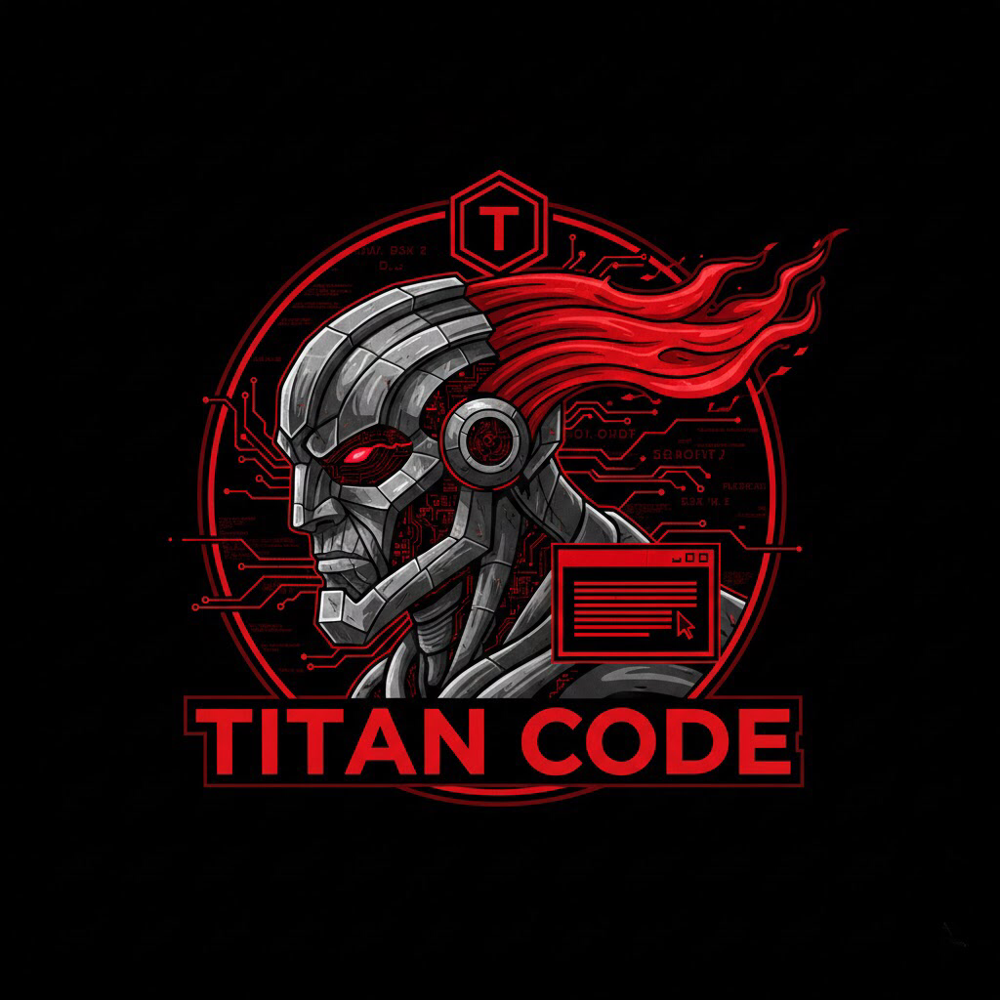

# Titan Code



# Titan Code ⚡

**The open-source terminal AI agent with job roles for your virtual startup team.**

Born from a fork of [OpenCode](https://github.com/anomalyco/opencode), Titan Code is what happens when you give an AI coding assistant the ability to switch personas. Need a Product Manager to brainstorm features? A UX Designer to map out user flows? A Data Analyst to dig into your metrics? Titan Code does it all—with strict boundaries so each role stays in its lane.

The red/black cyber-titan theme? Yeah, we went there. 😈

---

## Why Titan Code?

- **Role Switching on Steroids**: `/role product_manager` for planning, `/role ux_designer` for research, `/role data_analyst` for insights. Switch roles mid-convo and the AI immediately adapts its personality, prompts, and—most importantly—its tool permissions.
- **Strict Boundaries**: Product Manager literally can't edit your code—because we said so. Ask for something outside your role? It'll reject the request and tell you to switch. Professional. Focused. No accidents.
- **BYOK Everything**: Bring your own keys for Claude, Gemini, Grok, OpenAI, Ollama, or any OpenAI-compatible endpoint. Not tied to any provider.
- **Startup-Friendly**: Non-coding roles get useful tools (web search, planning outputs, file reads) without risky operations like `git push --force` or mass file edits. Default mode? Full engineering access. Simple.
- **100% Open Source**: Runs locally. Privacy-first. No lock-in. Your keys, your data, your rules.

---

## Installation

Same as OpenCode for now—same binary, same installer. We'll rename to `titancode` in a future release.

```bash
# YOLO (one-liner)
curl -fsSL https://opencode.ai/install | bash

# Package managers
npm i -g opencode-ai@latest        # or bun/pnpm/yarn
brew install anomalyco/tap/opencode # macOS/Linux
scoop install opencode              # Windows
choco install opencode              # Windows
sudo pacman -S opencode             # Arch Linux
```

Want the `titancode` binary now? Just alias it:

```bash
alias titancode=opencode  # add to your shell config
```

### Desktop App (Beta)

Download from [releases](https://github.com/anomalyco/opencode/releases) or [opencode.ai/download](https://opencode.ai/download).

---

## Quick Start

```bash
opencode  # or titancode if aliased
```

Inside the TUI:

| Command | What it does |
|---------|--------------|
| `/role list` | See all available roles |
| `/role product_manager` | Switch to PM mode (safe tools only) |
| `/role ux_designer` | Switch to UX mode |
| `/role data_analyst` | Switch to analyst mode |
| `/role default` | Full coding/engineering mode |

---

## Built-in Roles

| Role | What it does | Tools |
|------|--------------|-------|
| **Product Manager** | Strategy, roadmaps, user stories, PRs. Plans features, researches markets. | Web search, file read, planning outputs only |
| **UX Designer** | User research, wireframes, flows, personas. Asks "who is this for?" | Web search, file read, research tools |
| **Data Analyst** | Metrics, reports, SQL queries, charts. Digs into your data. | File read, SQL, basic command execution |
| **Marketing Specialist** | Copy, campaigns, content strategy, SEO, social. Writes the good stuff. | Web search, file read/write (copy only) |
| **Business Analyst** | Requirements, process maps, stakeholder interviews. Translates biz to tech. | Web search, file read |
| **Sales Representative** | Lead handling, pitch decks, CRM insights. Closes deals. | Web search, file read |
| **HR Specialist** | Job descriptions, policy docs, onboarding plans. People stuff. | Web search, file read/write |
| **Default (Engineer)** | Full coding, debugging, architecture. Everything OpenCode can do. | All tools—file edit, shell, git, MCP, everything |

More roles coming: CEO, CTO, CFO, COO, Engineering Manager, DevOps Engineer, QA, Security Analyst... basically every job title you need for a startup. 🎯

---

## Planned Features

- **50+ Job Roles** — More personas with custom system prompts and fine-tuned tool permissions
- **Web Search** — Tavily (BYOK) + DuckDuckGo fallback built-in
- **Custom Role Creator** — Define your own roles with YAML (name, description, allowed tools, system prompt)
- **Multi-Role Sessions** — PM + Engineer collaborating in tabs. Two heads better than one.
- **Local/Weak Model Optimization** — Running on a laptop? We'll make it work efficiently.
- **Figma Integration** — Pull designs directly into your workflow (later release)
- **Custom Tool Permissions** — Granular control over what each role can/cannot do

---

## Community

Follow the journey: [@titan_griid](https://x.com/titan_griid)

Discord coming soon—hang out, share ideas, break things together.

Questions? Bugs? Cool role ideas? Open an issue. We read everything.

---

## Contributing

This is a fork of OpenCode (anomalyco/opencode). We're building Titan Code as a community-driven project. Issues, PRs, role suggestions, feature ideas—all welcome!

Check [CONTRIBUTING.md](./CONTRIBUTING.md) for details.

**Contributions welcome!** 🚀

Let's build the AI team every startup deserves. 🚀
